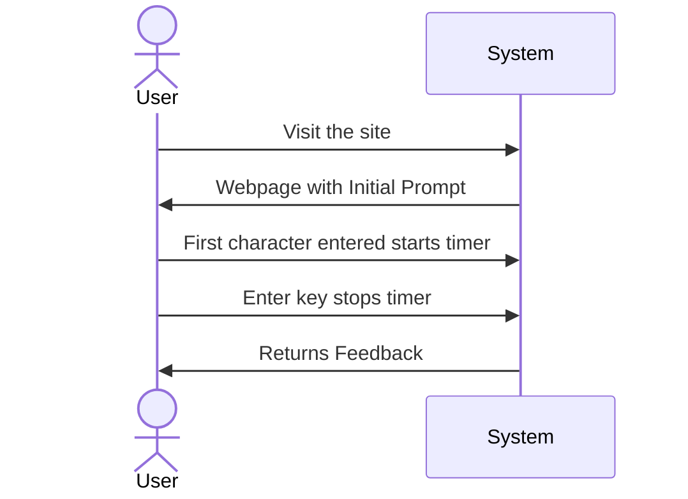

# Software Requirements Document

# Software Requirements for: ???

## TOC

## Identification

| Title | Author | Date | Status | Version |
|-------|--------|------|--------|--------|
| Elixir WPM | tindrew | 01.01.23 |Draft|

## Motivation
Elixir Words Per Minute is a typing game that reinforces the muscle memory of programming with the language in a fun way by having the user type random Elixir code snippets within a time frame.

One of the issues I have found with learning to program is a lack of recall for basic syntax of various code. This typing game will help in that regard. It isn't meant to sharpen the problem solving, only the recall of typing syntax and so in that way, helping the new programmer by enabling them to focus more on the problem solving side, and not worry so much about how to write the actual syntax.

## Context
This app should work on any desktop/laptop/browser.
This current version is an MVP, Minimum Viable product, and will only contain the bare essential features. more will be added at a later date.
## Design
[Link to design pdf](Elixir%20Words%20Per%20Minute.pdf)

## Use case

### Measure User's WPM for A Prompt

1. User visits website. Everything the user needs to play the game will be presented on one screen. For example in one corner, there will be a set of directions instructing the user what to do. The user will start typing to start the game.

2. 
On screen a snippet of code along with a box for the user to type into. The user will then try to write the code snippet completely before the timer runs out. Once the snippet is complete it will show the next snippet for a total of five snippets. 

3. Once all the snippets are complete (or the time has run out) the user will be presented with a percentage of completed snippets. for example, if he misses some key strokes, that will lower the score.

## Specification

## Validation

MVP will be manually tested.
1
