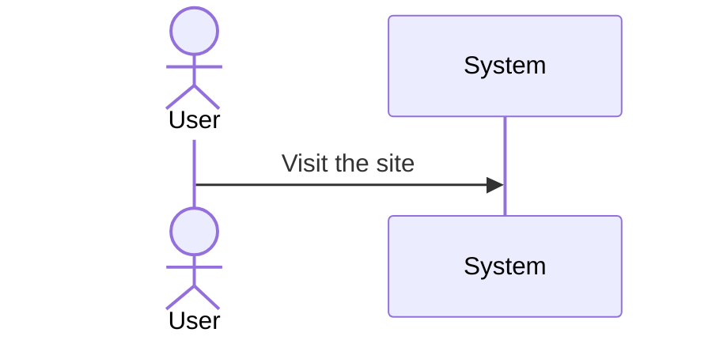

# Software Requirements Document

# Software Requirements for: ???

## TOC

## Identification

| Title | Author | Date | Status | Version |
|-------|--------|------|--------|--------|
| Elixir WPM | tindrew | 01.01.23 |Draft|

## Motivation
Elixir Words Per Minute is a typing game that reinforces the muscle memory of programming with the language in a fun way by having the user type random Elixir code snippets within a time frame.

One of the issues I have found with learning to program is a lack of recall for basic syntax of various code. This typing game will help in that regard. It isn't meant to sharpen the problem solving, only the recall of typing syntax and so in that way, helping the new programmer by enabling them to focus more on the problem solving side, and not worry so much about how to write the actual syntax.

## Context
This app should work on any desktop/laptop/browser.
This current version is an MVP, Minimum Viable product, and will only contain the bare essential features. more will be added at a later date.
## Design
[Link to design pdf](Elixir%20Words%20Per%20Minute.pdf)

## Use cases

### Measure user's WPM

1. User visits website. Everything the user needs to play the game will be presented on one screen. For example in one corner, there will be a set of directions instructing the user what to do. The User will click the start button to start the game.

2. Once the start button is clicked, a snippet of Elixir code will be presented, along with a box (or some other form) for the user to type into. The user will then try to write the code snippet completely before the timer runs out. Once the snippet is complete it will show the next snippet for a total of five snippets. 

3. Once all the snippets are complete (or the time has run out) the user will be presented with a percentage of completed snippets. for example, if he misses some key strokes, that will lower the score.

## Specification

## Validation

#### Examples

## Basic Outline

Here are the minimum sections you should have:

1. **Identification**: Title, Author, Date, etc
1. **Motivation**: Why is the SW being written?
1. **Influences**: What concepts -- OO/Functional, Relational/Key-Value, Semantic Data, Regression/Stastical/Network ML -- are influencing the purpose, design and construction of the SW? What other SW is similar?
1. **Context**: Who is the SW for? How is to be run?
1. **Design**: What is the high-level design?
1. **Specification**: What are the SW's: interfaces, functions, useability, etc.
1. **Validation**: How is the SW to be tested?

## Details

### Identification

### Motivation

This section goes by a number of other terms such as (business) *purpose* or *need*.

The purpose of this section is to describe:

1. why the software should exist
1. who the software is for
1. asdf

### Influences

This purpose of this section is . . .

### Context

This section is sometimes called *environment*.

The purpose of this section is to describe the conditions under which the software is expected to operate. It should also describe conditions and constraints in which the software is expected to degrade or cease to function altogether.

Examples of relevant information:

1. Hardware (system) requirement
1. asdf

### Design Overview

This section is sometimes called *(system) architecture*.

#### Use Cases

#### Personas

#### Diagrams

Useful diagrams include:

* [Sequence](https://en.wikipedia.org/wiki/Sequence_diagram)
* [Activity](https://en.wikipedia.org/wiki/Activity_diagram)
* [Causal Loop](https://thesystemsthinker.com/causal-loop-construction-the-basics/)
* [State](https://en.wikipedia.org/wiki/State_diagram)

### Requirements Specification

#### Interfaces

Describe the interfaces:

* The SW as a black box

#### Functional

#### Useability

#### Observability

#### Sustainability

### Verification

This section is sometimes called *(software or system) testing*.
