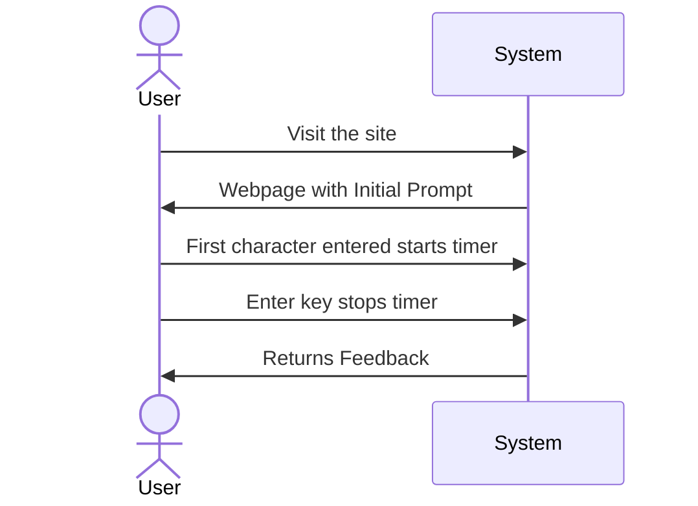

# Software Requirements Document

# Software Requirements for: ElixirWPM

## TOC

## Identification

| Title | Author | Date | Status | Version |
|-------|--------|------|--------|--------|
| Elixir WPM | tindrew | 01.01.23 |Draft|0.2

## Motivation
Elixir Words Per Minute is a typing game that reinforces the muscle memory of programming with the language in a fun way by having the user type random Elixir code snippets within a time frame.

One of the issues I have found with learning to program is a lack of recall for basic syntax of various code. This typing game will help in that regard. It isn't meant to sharpen the problem solving, only the recall of typing syntax and so in that way, helping the new programmer by enabling them to focus more on the problem solving side, and not worry so much about how to write the actual syntax.

## Context
This app should work on any desktop/laptop/browser.
This current version is an MVP, Minimum Viable Product, and will only contain the bare essential features. more will be added at a later date.
## Design
[Link to design pdf](Elixir%20Words%20Per%20Minute.pdf)

## Use case

### Measure User's WPM for A Prompt

1. User visits website. Everything the user needs to play the game will be presented on one screen. For example in one corner, there will be a set of directions instructing the user what to do. The user will start typing to start the game.

2. 
On screen a snippet of code along with a box for the user to type into. The user will then try to write the code snippets completely before the timer runs out. Once the snippet is complete it will show the next snippet.

3. Once the time has run out the user will be presented with the average WPM and a score based on the correctness of the typed snippets. for example, if he misses some key strokes, that will lower the score.

4. Add summary page for metrics

## Options

1. User will be able to select a time in minutes that they want to play the game.
2. Time stamps for each character typed

## Specification

## Validation

MVP will be manually tested.
1

## Roadmap

- Syntax highlighting
- User signup / login
- Leaderboards

#### notes

Database:
1. need to save scores to database
2. allow only users to save scores
3. display scores
4. update score if current score is higher than previous, otherwise nothing/discard
5. add to playerscore? 
- 
alias ElixirWPM.Leaderboards.PlayerScore
alias ElixirWPM.Repo

Repo.insert(%PlayerScore{total_score: 44})
Repo.insert(%PlayerScore{total_score: 44})

def handle_event("change", form_data, socket) do
  elapsed_time = 60.0
  text_input = form_data["textinput"]["name"] |> IO.inspect()

  word_count = String.length(text_input) / 5

  minutes = elapsed_time / 60.0
  words_per_minute = (word_count / minutes) |> round
  IO.inspect(words_per_minute)

  # Save score to database
  score = %{words_per_minute: words_per_minute}
  Repo.insert(:scores, score)

  {:noreply, assign(socket, text_input: text_input, words_per_minute: words_per_minute)}
end

currently it looks like my wpm is getting submitted every single snippet. Is that what I want to happen?
 Honestly I have no idea.

 yes I do

 so I want total score to be updated during the game. 
 - Every time I submit a snippet I want total score updated to reflect those scores. 
 - At the end of the session I want words per minute added to it

make a elapsed_time field in mount

# raw words per minute is a calculation of how fast you type with no errors
# a "word" is any five characters. spaces, numbers, letters and punctuation are all included
# edge cases: function keys or anything not a number, letter, space, or punctuation should be excluded
# count number of characters typed. divide by 5
# divide number of mistakes by total of typed characters

# start = DateTime.now!("Etc/UTC")
# finish = DateTime.now!("Etc/UTC")
# minutes = DateTime.diff(finish, start) |> div(60)
# IO.inspect(minutes)

# jaro distance?

# final_wpm: take another wpm count starting from initial start to when the
# session timer ends.

login - sudo su - postgres\
psql postgres #gets you into postgres
\l lists databases
\c name_of_table
\d
\d+
\d+ player_scores
or \d player_scores
select total_score FROM player_scores;
select * FROM player_scores;

# score = %{total_score: socket.assigns.total_score}
          # Repo.insert(:scores, score)

          # Leaderboards.create_player_score(%{total_score: socket.assigns.total_score})
          # assign(socket, playing: false, words_per_minute: wpm)

observe /what is it telling you, use things like IO inspect, try to understand what is happening
hypothesis "what did I observe?"
verify the hypothesis: I.e. run a test. physical test, or write a test, etc etc

muscle memory - emphasize that this app is a method for better familiarize yourself with the act 
of writing elixir, the words per minute aspect is more for the fun gaming aspect.